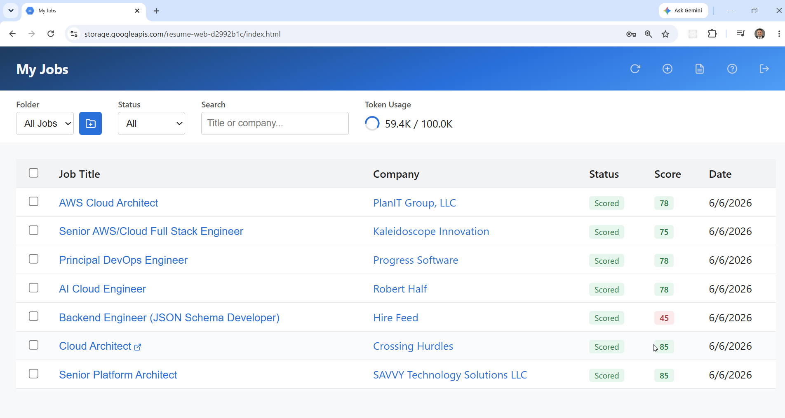
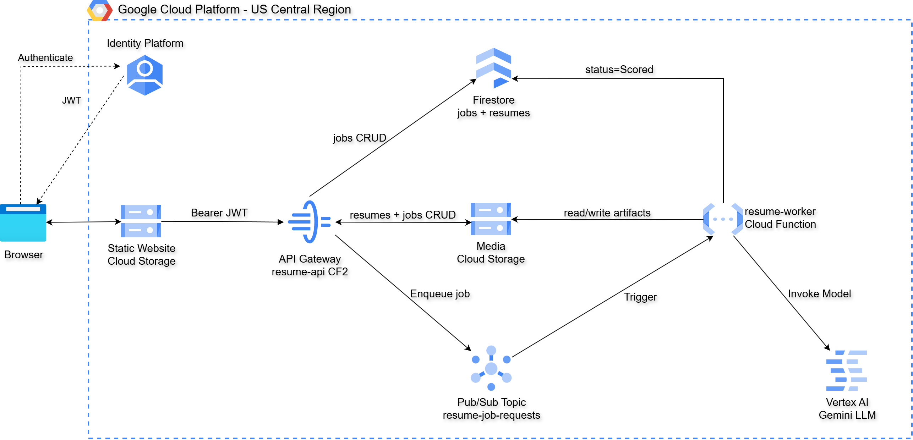

# GCP Serverless Resume Scoring Application

This project delivers a fully automated **serverless resume scoring application**
on GCP, built using **GCP API Gateway**, **Cloud Functions 2nd Gen**,
**Cloud Firestore**, **Cloud Pub/Sub**, and **Vertex AI (Gemini)**.

It uses **Terraform** and **Python** to provision and deploy an
**asynchronous, AI-powered scoring pipeline** secured with **JWT-based
authentication**, allowing users to upload resumes and submit job postings for
compatibility scoring — all without running or managing any virtual machines.

Users submit a resume and a job posting (as a URL, raw text, or LinkedIn job
ID). The application uses **Vertex AI Gemini** to extract structured job
metadata and score the resume against the job on a scale of 0–100, with a
written analysis broken into **Strengths** and **Weaknesses** sections.

Authentication and authorization are handled natively by **GCP Identity
Platform (Firebase Auth)**, allowing users to sign in with email-based
credentials directly in the app. Firebase JWTs are validated by API Gateway
before requests reach Cloud Functions.



A **vanilla JavaScript single-page application** hosted on GCS integrates
with Identity Platform's JavaScript SDK and interacts directly with the secured
API, allowing authenticated users to manage resumes, submit jobs for scoring,
and review AI-generated analysis from a browser.

This design follows a **serverless event-driven architecture** where API
Gateway routes authenticated requests to a Cloud Function, Pub/Sub decouples
job submission from scoring, and Vertex AI handles inference on demand — with
GCP managing scaling, availability, and fault tolerance automatically.

The Gemini model is fully parameterized — see
[Changing the Gemini Model](#changing-the-gemini-model). Swapping models
requires only editing one export line in `gemini-config.sh`.

## Key Capabilities Demonstrated

1. **AI-Powered Resume Scoring** – Vertex AI Gemini extracts job metadata and
   scores resume-to-job compatibility (0–100) with a written
   Strengths/Weaknesses analysis. Scoring uses `temperature=0` (greedy
   decoding) to produce consistent, deterministic scores across repeated
   submissions of the same resume and job.
2. **Asynchronous Job Processing** – Pub/Sub decouples job submission from
   scoring. The API returns immediately with a `submitted` status while a
   worker Cloud Function processes the job in the background.
3. **Native GCP Authentication** – Identity Platform (Firebase Auth) issues and
   manages JWTs, eliminating the need for custom authentication logic in Cloud
   Functions. API Gateway validates tokens via OpenAPI `securityDefinitions`.
4. **Serverless Event-Driven Architecture** – No VMs, containers, or VPC
   networking required. Cloud Functions scale on demand and cost nothing at idle.
5. **Infrastructure as Code (IaC)** – Terraform provisions all resources —
   API Gateway, Cloud Functions, Firestore, Pub/Sub, GCS, IAM, and Vertex AI
   permissions — across three independent phases.
6. **Firestore Data Model** – Resumes, jobs, folders, and per-user token usage
   are stored in separate Firestore collections with `{owner_uid}_{resource_id}`
   document IDs for per-user data isolation.
7. **AI Token Usage Tracking** – Cumulative Gemini token consumption is tracked
   per user in Firestore using atomic increments. A configurable per-user
   lifetime cap (default 100,000 tokens) is enforced at job submission. The UI
   displays a live circular ring indicator with remaining tokens.
8. **File Attachments** – Each scored job can have arbitrary files attached
   (correspondence, tailored resumes, cover letters, etc.). Files are stored in
   GCS and transferred as base64 JSON through the API (10 MB per file limit).
   The dashboard shows a paperclip icon on rows that have attachments; clicking
   it opens a dropdown to download any file without leaving the page. Full
   upload/download/delete management is on the job detail page.
9. **Browser-Based Frontend** – A static GCS-hosted SPA demonstrates in-page
   Firebase auth, real-time polling for scoring results, job folder
   organization, bulk operations, and polished modal dialogs throughout.

## Architecture



## Prerequisites

* [A GCP Project](https://console.cloud.google.com/) with billing enabled
* [Install gcloud CLI](https://cloud.google.com/sdk/docs/install)
* [Install Terraform](https://developer.hashicorp.com/terraform/install)
* [Install Python 3.11+](https://www.python.org/downloads/)
* [Install jq](https://jqlang.github.io/jq/download/)
* A **service account key file** (`credentials.json`) in the repo root 

If this is your first time using GCP with Terraform, we recommend reviewing
the [gcloud quickstart](https://cloud.google.com/sdk/docs/quickstart) and
ensuring your project has billing enabled before running `apply.sh`.

## Download this Repository

```bash
git clone https://github.com/mamonaco1973/gcp-resume-app.git
cd gcp-resume-app
```

Place your service account `credentials.json` in the repo root before
running any scripts.

## Build the Code

Run [check_env](check_env.sh) to validate your environment, then run
[apply](apply.sh) to provision all infrastructure and deploy the frontend.

```bash
~/gcp-resume-app$ ./apply.sh
NOTE: Running environment validation...
NOTE: Validating that required commands are found in your PATH.
NOTE: gcloud is found in the current PATH.
NOTE: terraform is found in the current PATH.
NOTE: jq is found in the current PATH.
NOTE: pip is found in the current PATH.
NOTE: credentials.json found. Project: my-project-id
NOTE: Activated service account: resume-deployer@my-project-id.iam.gserviceaccount.com
NOTE: Checking Vertex AI Gemini model gemini-2.0-flash-001...
NOTE: Vertex AI Gemini access confirmed.
...
=================================================================================
  Resume Scorer — Deployment validated!
=================================================================================
  App : https://storage.googleapis.com/resume-web-<hex>/index.html
  API : https://resume-gateway-<hex>.uc.gateway.dev
=================================================================================
```

`apply.sh` performs the following steps in order:

1. Sources `gemini-config.sh` to set `GEMINI_MODEL_ID`
2. Runs `check_env.sh` to validate CLI tools, `credentials.json`, and Vertex AI access
3. Installs Python dependencies into `02-functions/code/api/` and `02-functions/code/worker/`
4. Runs `terraform apply` on `01-backend` — provisions service accounts, IAM, GCS media bucket, Pub/Sub, and Identity Platform API key
5. Runs `terraform apply` on `02-functions` — deploys Cloud Functions and API Gateway
6. Runs `terraform apply` on `03-webapp` — creates the public GCS website bucket
7. Reads Terraform outputs and writes `03-webapp/site/js/config.js` from the template
8. Syncs the frontend to the GCS website bucket (excluding `*.tmpl` files)
9. Runs `validate.sh` to print the live URLs

### Build Results

When the deployment completes, the following resources are created:

- **Core Infrastructure:**
  - Fully serverless architecture — no VMs, containers, or VPC networking required
  - Three independent Terraform state phases for clean separation of concerns
  - Asynchronous scoring pipeline decoupled via Pub/Sub for reliable processing

- **Security, Identity & IAM:**
  - **GCP Identity Platform** (Firebase Auth) providing managed user authentication
    and JWT issuance with email-based sign-up and password reset
  - API Gateway **Firebase JWT validation** via OpenAPI `securityDefinitions`
    (`x-google-issuer`, `x-google-jwks_uri`, `x-google-audiences`)
  - Dedicated service accounts (`resume-api-sa`, `resume-worker-sa`) scoped to
    least-privilege; no shared credentials between functions
  - `credentials.json` key file kept out of version control via `.gitignore`

- **Cloud Firestore:**
  - Four collections: `resume_app_resumes`, `resume_app_jobs`,
    `resume_app_folders`, and `resume_app_users`
  - Document IDs: `{owner_uid}_{resource_id}` for per-user data isolation
    (except `resume_app_users`, which uses `{owner_uid}` directly)
  - Composite indexes on `owner ASC, created_at DESC` for efficient list queries
  - `resume_app_users` stores `tokens_used` (atomic Firestore `Increment`) and
    an optional per-user `token_limit` override; defaults to 100,000 tokens

- **Cloud Functions 2nd Gen:**
  - **`resume-api`** (HTTP, 256 MB, 60 s) — routes all API Gateway requests to
    resume, job, folder, token-usage, and attachment handlers; extracts owner
    UID from the `X-Apigateway-Api-Userinfo` header injected by API Gateway;
    enforces the per-user token cap with a `429` response before publishing to
    Pub/Sub; stores and retrieves attachment files in GCS and metadata in the
    Firestore job document `attachments` array
  - **`resume-worker`** (Eventarc/Pub/Sub, 512 MB, 300 s) — decodes job
    requests, fetches URLs with HTML stripping, calls Gemini for extraction
    and scoring, writes results to GCS, updates Firestore with score and status,
    and atomically increments `tokens_used` in `resume_app_users`

- **Cloud Pub/Sub:**
  - `resume-job-requests` topic receives job scoring requests from `resume-api`
  - Subscription with 300 s ack deadline aligned to the worker function timeout
  - Dead-letter topic (`resume-job-requests-dlq`) captures messages that fail
    after 5 attempts (backoff 10 s–600 s)

- **Vertex AI (Gemini):**
  - **Extraction call** — given raw page text or a job URL, extracts
    `job_title`, `company_name`, and a cleaned `job_text` (capped at 3000 chars)
  - **Scoring call** — scores the resume against the cleaned job description
    (0–100) with a written analysis covering Overview, Strengths, and Weaknesses
  - Both calls use `temperature=0` (greedy decoding) for deterministic,
    reproducible scores
  - Model parameterized via `GEMINI_MODEL_ID` environment variable
  - Token usage (`usage_metadata.total_token_count`) is captured from every
    response and written to Firestore via an atomic increment

- **Cloud Storage:**
  - **Media bucket** (`resume-media-{suffix}`) — stores resume text, job
    descriptions, resume snapshots, job analyses, user notes, and job
    attachments at deterministic per-job paths; private, uniform bucket-level
    access; attachment paths follow
    `users/{owner}/jobs/{job_id}/attachments/{att_id}/{filename}`
  - **Website bucket** (`resume-web-{suffix}`) — hosts the static SPA with
    `allUsers` objectViewer and GCS website hosting enabled

- **GCP API Gateway:**
  - Single gateway routes all `/resumes`, `/jobs`, `/folders`, and `/usage`
    paths to `resume-api` via `x-google-backend` (h2 protocol)
  - OpenAPI 2.0 spec with Firebase JWT `securityDefinitions`
  - OPTIONS methods left unauthenticated for CORS preflight

- **Static Web Application (GCS):**
  - Vanilla JavaScript SPA with no build step or framework dependencies
  - Firebase JS SDK v11.1.0 loaded via HTML importmap — no npm required
  - In-page sign-in/sign-up modal with **Forgot Password** support via Firebase
    `sendPasswordResetEmail`; `onAuthStateChanged` drives the entire UI
  - Polls `GET /jobs` (5 s auto-refresh) to surface scoring results as they
    complete; spinner and countdown shown in the header while jobs are pending
  - **Token usage ring** in the filter bar shows remaining lifetime tokens as a
    circular SVG arc with `"X.XK / 100K"` label; turns red at 80% consumed;
    hover text shows exact counts and percentage
  - **Folder management** — jobs can be organized into named folders; filter
    bar lets users switch between folders or view all jobs
  - **Bulk operations** — select multiple jobs via checkboxes; bulk delete or
    bulk move to a folder from the action bar
  - **File attachments** — each job can hold arbitrary attachments (PDFs,
    Word docs, images, etc.); the dashboard shows a paperclip icon on rows
    with attachments and a click-to-download dropdown; full manage
    (upload / download / delete) is on the job detail page
  - **Guard dialogs** — attempting to score a job with no resumes on file shows
    a modal alert, then automatically opens the Manage Resumes dialog
  - All confirmations and prompts use styled in-page modal dialogs; no
    `window.alert` / `window.confirm` / `window.prompt` calls
  - `config.js` is generated at deploy time from a template — never edited
    directly

Together, these resources form a **secure, AI-powered serverless application**
that demonstrates modern GCP architecture principles — **event-driven,
fully managed, and identity-aware** — with all AI inference handled on demand
through Vertex AI.

## API Gateway Endpoints

The **Resume Scoring API** is secured using **Firebase JWT validation** in the
API Gateway OpenAPI spec. All requests must include a valid
**Authorization: Bearer \<JWT\>** header issued by Identity Platform.

### Resumes

| Method | Path | Purpose |
|--------|------|---------|
| POST | `/resumes` | Upload a new resume |
| GET | `/resumes` | List all resumes for the authenticated user |
| GET | `/resumes/{resume_id}` | Retrieve a resume with full text |
| PUT | `/resumes/{resume_id}` | Replace a resume name and text |
| DELETE | `/resumes/{resume_id}` | Delete a resume |

### Jobs

| Method | Path | Purpose |
|--------|------|---------|
| POST | `/jobs` | Submit a job for scoring (URL, raw text, or LinkedIn ID) |
| GET | `/jobs` | List all jobs for the authenticated user |
| GET | `/jobs/{job_id}` | Retrieve a job with score and analysis |
| PATCH | `/jobs/{job_id}/notes` | Update user notes on a job |
| PATCH | `/jobs/{job_id}/folder` | Move a job to a folder |
| DELETE | `/jobs/{job_id}` | Delete a job and all associated GCS artifacts |
| GET | `/jobs/{job_id}/attachments` | List attachments for a job |
| POST | `/jobs/{job_id}/attachments` | Upload a file attachment (base64 JSON, 10 MB max) |
| GET | `/jobs/{job_id}/attachments/{att_id}` | Download an attachment (base64 JSON response) |
| DELETE | `/jobs/{job_id}/attachments/{att_id}` | Delete an attachment |

### Folders

| Method | Path | Purpose |
|--------|------|---------|
| POST | `/folders` | Create a named folder |
| GET | `/folders` | List all folders for the authenticated user |
| DELETE | `/folders/{folder_id}` | Delete a folder (jobs remain, unassigned) |

### Usage

| Method | Path | Purpose |
|--------|------|---------|
| GET | `/usage` | Return `tokens_used` and `token_limit` for the authenticated user |

### Request & Response Characteristics

| Aspect | Behavior |
|--------|----------|
| Authentication | Firebase JWT (Identity Platform) |
| Authorization | Enforced via Firestore document `owner` field |
| Identity Source | Firebase JWT `sub` claim (UID) |
| Content Type | `application/json` |
| Response Format | JSON |
| Timestamps | Milliseconds since epoch (compatible with JS `new Date()`) |
| Token cap exceeded | `429` with `error` message |
| Error Handling | Standard HTTP status codes |

---

### POST /resumes

**Purpose:**
Upload a resume for use in job scoring.

**Request Headers:**
```
Authorization: Bearer <JWT_TOKEN>
Content-Type: application/json
```

**Request Body (JSON):**
```json
{
  "name": "Software Engineer Resume",
  "resume": "Full resume text goes here..."
}
```

**Parameters:**

| Field | Type | Required | Description |
|-------|------|----------|-------------|
| name | string | Yes | Display name for the resume |
| resume | string | Yes | Full plain-text resume content |

**Example Request:**
```bash
curl -s -X POST https://resume-gateway-<hex>.uc.gateway.dev/resumes \
  -H "Authorization: Bearer <JWT_TOKEN>" \
  -H "Content-Type: application/json" \
  -d '{"name":"My Resume","resume":"John Smith, Software Engineer..."}'
```

**Example Response (200):**
```json
{
  "resume_id": "a1b2c3d4-1234-5678-abcd-ef1234567890",
  "name": "My Resume"
}
```

---

### POST /jobs

**Purpose:**
Submit a job posting for AI scoring against a previously uploaded resume.
Returns immediately with `submitted` status while scoring runs asynchronously.
Returns `429` if the user has exhausted their lifetime token allowance.

**Request Body (JSON) — URL source:**
```json
{
  "resume_id": "a1b2c3d4-...",
  "source_type": "url",
  "job_url": "https://www.linkedin.com/jobs/view/1234567890"
}
```

**Request Body (JSON) — Raw text source:**
```json
{
  "resume_id": "a1b2c3d4-...",
  "source_type": "raw_text",
  "job_description": "We are looking for a Senior Python Engineer..."
}
```

**Parameters:**

| Field | Type | Required | Description |
|-------|------|----------|-------------|
| resume_id | string | Yes | ID of the resume to score against |
| source_type | string | Yes | `url`, `raw_text`, or `linkedin_job_id` |
| job_url | string | If `url` | URL of the job posting |
| job_description | string | If `raw_text` | Full job description text |
| folder_id | string | No | Folder to assign the job to on creation |

**Example Response (200):**
```json
{
  "job_id": "b2c3d4e5-1234-5678-abcd-ef1234567890",
  "status": "submitted",
  "status_message": "Job submitted for scoring"
}
```

**Job Status Values:**

| Status | Meaning |
|--------|---------|
| `submitted` | Job queued, worker not yet started |
| `Scoring` | Worker is actively processing |
| `Scored` | Scoring complete, results available |
| `Failed` | Processing failed, see `status_message` |

---

### GET /jobs/{job_id}

**Purpose:**
Retrieve a scored job with full analysis. Poll this endpoint after submission
until `status` is `Scored` or `Failed`.

**Example Response (200):**
```json
{
  "job_id": "b2c3d4e5-...",
  "job_title": "Senior Python Engineer",
  "company": "Acme Corp",
  "status": "Scored",
  "score": 78,
  "job_analysis": "Strengths: ...\n\nWeaknesses: ...",
  "job_description": "We are looking for...",
  "resume_snapshot": "John Smith...",
  "notes": "",
  "folder_id": null,
  "created_at": 1742237400000,
  "updated_at": 1742237535000
}
```

---

### GET /usage

**Purpose:**
Return the authenticated user's cumulative token consumption and their
configured limit. Used by the frontend to render the token usage ring.

**Example Response (200):**
```json
{
  "tokens_used": 17432,
  "token_limit": 100000
}
```

The `token_limit` can be raised or reset per user by editing the
`resume_app_users/{uid}` document directly in the Firebase console.
Set `tokens_used` to `0` to reset a user's counter without redeploying.

---

### POST /jobs/{job_id}/attachments

**Purpose:**
Upload a file attachment to a scored job. Files are stored in GCS; metadata
(filename, size, content type, upload timestamp, attachment ID) is appended to
the `attachments` array on the Firestore job document.

**Request Body (JSON):**
```json
{
  "filename": "cover-letter.pdf",
  "content_type": "application/pdf",
  "data": "<base64-encoded file bytes>"
}
```

**Parameters:**

| Field | Type | Required | Description |
|-------|------|----------|-------------|
| filename | string | Yes | Original filename (preserved in GCS and response) |
| content_type | string | Yes | MIME type (e.g. `application/pdf`, `image/png`) |
| data | string | Yes | Base64-encoded file bytes. 10 MB hard limit |

**Example Response (200):**
```json
{
  "attachment_id": "c3d4e5f6-...",
  "filename": "cover-letter.pdf"
}
```

---

### GET /jobs/{job_id}/attachments

**Purpose:**
List all attachments for a job. Returns metadata only — no file bytes.

**Example Response (200):**
```json
[
  {
    "attachment_id": "c3d4e5f6-...",
    "filename": "cover-letter.pdf",
    "content_type": "application/pdf",
    "size": 45312,
    "uploaded_at": 1742237600000
  }
]
```

---

### GET /jobs/{job_id}/attachments/{att_id}

**Purpose:**
Download an attachment. Returns the file bytes as base64 JSON.

**Example Response (200):**
```json
{
  "attachment_id": "c3d4e5f6-...",
  "filename": "cover-letter.pdf",
  "content_type": "application/pdf",
  "data": "<base64-encoded file bytes>"
}
```

The frontend decodes `data` via `atob()` → `Uint8Array` → `Blob` and triggers
a browser download using a temporary object URL.

---

### DELETE /jobs/{job_id}/attachments/{att_id}

**Purpose:**
Delete an attachment. Removes the GCS blob and filters the `attachments` array
on the Firestore job document using a read-modify-write (not `ArrayRemove`,
which requires exact dict equality).

**Response:** `200 {}` on success.

---

## AI Token Tracking

Every Gemini inference call in the worker function captures
`usage_metadata.total_token_count` from the response and writes it to
Firestore using an atomic `Increment`, so concurrent jobs never lose counts.

The per-user cap is enforced in the API function before the job is published
to Pub/Sub. When the limit is reached, `POST /jobs` returns:

```json
{
  "error": "Token limit reached. You have used your 100,000-token lifetime allowance."
}
```

To manage limits in the Firebase console:

- **Reset a user's counter:** set `tokens_used = 0` in
  `resume_app_users/{uid}`
- **Raise a user's limit:** add or set `token_limit` to the desired value in
  `resume_app_users/{uid}` (e.g. `500000`); omitting the field falls back to
  the 100,000 default

---

## Changing the Gemini Model

The model is parameterized end-to-end. To retarget, edit the `export` line in
[gemini-config.sh](gemini-config.sh) — sourced by both `apply.sh` and
`check_env.sh`:

```bash
export GEMINI_MODEL_ID="gemini-2.0-flash-001"
```

This value flows automatically to:

- **`check_env.sh`** — pre-flight probe that the model is accessible before
  any Terraform runs
- **`02-functions/` Terraform** — worker Cloud Function `GEMINI_MODEL_ID`
  environment variable
- **`02-functions/code/worker/main.py`** — reads `GEMINI_MODEL_ID` at runtime
  and passes it to the Vertex AI SDK

If the new model uses a different prompt format or response schema, also update
the prompt strings in [02-functions/code/worker/main.py](02-functions/code/worker/main.py).

## Destroy

```bash
./destroy.sh
```

Tears down all infrastructure provisioned by `apply.sh`. The destroy script:

1. Runs `terraform destroy` on `03-webapp`
2. Runs `terraform destroy` on `02-functions`
3. Empties the GCS media bucket via `gcloud storage rm`
4. Deletes all Firestore documents from all four collections
   (`resume_app_jobs`, `resume_app_resumes`, `resume_app_folders`,
   `resume_app_users`) via the REST API
5. Runs `terraform destroy` on `01-backend`

## Using the Application

Once deployed, open the **App URL** printed by `validate.sh` in your browser.
The full workflow is:

### 1. Sign In

Click **Sign In** to open the **authentication modal**. On first use, click
**Create Account**, enter your email address and a password (minimum 6
characters), and click **Create Account** to register.

After account creation you are signed in automatically and the
**Job Scoring Dashboard** appears.

On subsequent visits, click **Sign In**, enter your credentials, and click
**Sign In** to authenticate. If you forget your password, click
**Forgot password?** to receive a reset email from Identity Platform.

### 2. Add a Resume

Before scoring any jobs you need at least one resume on file.

1. Click the **Manage Resumes** icon button in the header.
2. Click **New Resume**, give it a name (e.g. `Software Engineer Resume`), and
   paste the full plain-text content of your resume into the text area.
3. Click **Create Resume**. The resume is stored in GCS and available
   immediately for scoring.

You can create multiple resumes (e.g. one tailored for backend roles, one for
management) and choose between them at scoring time. Use the sidebar to switch
between resumes, edit text, or delete ones you no longer need.

> **Tip:** If you click **Score New Job** before any resume exists, the app
> shows an alert and automatically opens the Manage Resumes dialog so you can
> add one without navigating away.

### 3. Score a Job

1. Click the **Score New Job** icon button in the header.
2. Select the resume you want to score against from the **Resume** dropdown.
3. Optionally assign the job to a **Folder** to keep your dashboard organized.
4. Choose a **Source Type**:

   | Source Type | When to use |
   |-------------|-------------|
   | **Job URL** | Paste a direct link to any publicly accessible job posting (LinkedIn, Indeed, company careers page, etc.) |
   | **Paste Job Description** | Paste the raw job description text directly — useful when a URL requires login |
   | **LinkedIn Job IDs** | Enter one or more numeric LinkedIn job IDs (one per line) to batch-submit multiple jobs at once |

5. Click **Submit**. The job is queued immediately and the modal closes.

### 4. Monitor Scoring Progress

The dashboard shows all submitted jobs. While a job is being processed:

- The **Status** badge for that row shows `submitted` or `Scoring`.
- A **spinner and countdown** appear in the header — the list refreshes
  automatically every 5 seconds until all pending jobs reach a terminal state.
- You can also click the **Refresh** icon at any time to poll immediately.

Scoring typically takes **15–60 seconds** depending on Gemini response time
and whether the job URL requires fetching and HTML parsing.

### 5. View the Analysis

Once the status changes to **Scored**, click the job row to view the full
result. The job detail page shows:

- **Score** — a 0–100 compatibility rating (deterministic; the same resume +
  job always produces the same score)
- **Analysis** — Overview, Strengths, and Weaknesses sections generated by
  Gemini
- **Job Description** — the cleaned job text used for scoring
- **Resume Snapshot** — the version of your resume that was scored (captured
  at submission time, so edits to the resume afterwards do not affect past
  scores)

### 6. Attach Files

On the job detail page, the **Attachments** accordion (open by default) lets
you upload arbitrary files to the job — custom resumes, cover letters,
correspondence, screenshots, and so on.

1. Click **Upload File** and select one or more files (PDFs, Word docs, images,
   ZIPs, CSVs, and Excel files are accepted; 10 MB per file).
2. Each file is stored in the GCS media bucket and its metadata (name, size,
   type, upload time) is saved in the Firestore job document.
3. Use the **Download** button on any listed file to retrieve it. Use the
   **Delete** (trash) button to remove it permanently.

From the **Job Scoring Dashboard**, any job row that has at least one
attachment shows a **paperclip icon** in the rightmost column. Clicking it
opens a small dropdown listing the filenames — click any filename to download
it directly without navigating away from the dashboard.

### 7. Add Notes

On the job detail page you can type personal notes (interview prep, recruiter
contact details, application status, etc.) into the **Notes** field and save
them. Notes are stored in GCS and are private to your account.

### 8. Organize with Folders

Use the **New Folder** icon in the filter bar to create named folders
(e.g. `Applied`, `Interviewing`, `Rejected`). Jobs can be assigned to a folder
at submission time or moved later via the **bulk move** action. Use the
**Folder** dropdown in the filter bar to view only jobs in a specific folder.
Delete a folder with the **Delete Folder** icon — jobs in the folder are
unassigned but not deleted.

### 9. Bulk Operations

Check one or more rows in the dashboard to reveal the **bulk action bar**:

- **Delete Selected** — permanently removes all selected jobs and their GCS
  artifacts
- **Move to Folder** — reassigns all selected jobs to the chosen folder

### 10. Monitor Token Usage

The **Token Usage** indicator in the filter bar shows how many Gemini tokens
remain in your lifetime allowance:

- The **circular ring** depletes as tokens are consumed; the arc turns red when
  80% of the allowance is used
- The **label** shows remaining tokens in `K` notation (e.g. `82.5K / 100K`)
- **Hover** over the indicator for exact counts and percentage used

The indicator updates automatically after login and after each job is
submitted. When the allowance is exhausted, new job submissions are blocked
until an administrator resets `tokens_used` to `0` in the Firebase console
(`resume_app_users/{uid}`).

### 11. Delete Jobs

Select one or more rows and use the bulk delete action, or open a job and
delete it individually. Deletion is confirmed via a modal dialog and cannot
be undone — the Firestore record and all associated GCS artifacts (job
description, resume snapshot, analysis, and notes) are removed permanently.
