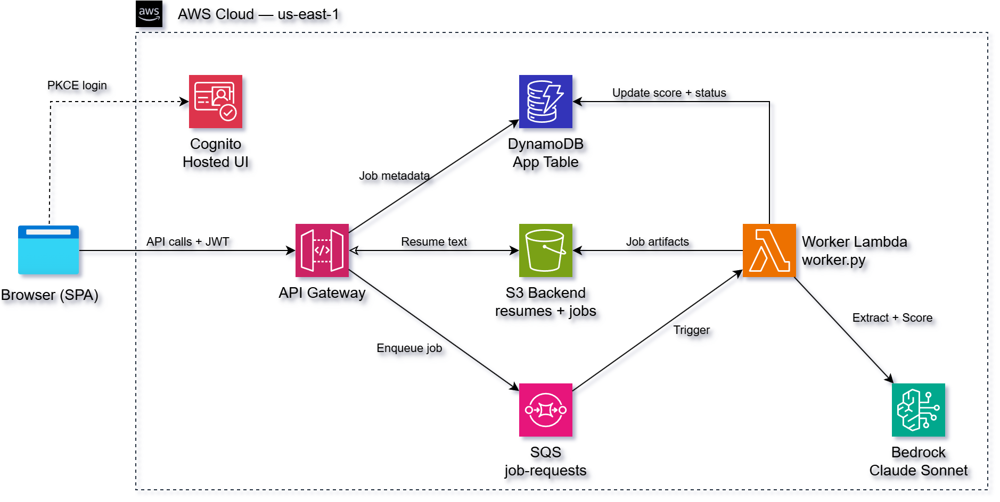

# AWS Serverless Resume Scoring Application with Bedrock, Lambda, DynamoDB, SQS, and API Gateway

This project delivers a fully automated **serverless resume scoring application**
on AWS, built using **Amazon API Gateway**, **AWS Lambda**, **Amazon DynamoDB**,
**Amazon SQS**, and **AWS Bedrock**.

It uses **Terraform** and **Python (boto3)** to provision and deploy an
**asynchronous, AI-powered scoring pipeline** secured with **JWT-based
authentication**, allowing users to upload resumes and submit job postings for
compatibility scoring — all without running or managing any EC2 instances.

Users submit a resume and a job posting (as a URL or raw text). The application
uses **AWS Bedrock (Claude Haiku)** to extract structured job metadata and score
the resume against the job on a scale of 0–100, with a written analysis broken
into **Strengths** and **Weaknesses** sections.

Authentication and authorization are handled natively by **Amazon Cognito**,
allowing users to sign in with email-based credentials and obtain JWT tokens
validated directly by API Gateway before requests reach Lambda.


A **vanilla JavaScript single-page application** hosted on S3 integrates with
Cognito's Hosted UI and interacts directly with the secured API, allowing
authenticated users to manage resumes, submit jobs for scoring, and review
AI-generated analysis from a browser.

This design follows a **serverless event-driven architecture** where API Gateway
routes authenticated requests to Lambda, SQS decouples job submission from
scoring, and Bedrock handles AI inference on demand — with AWS managing scaling,
availability, and fault tolerance automatically.

The Bedrock model is fully parameterized — see
[Changing the Bedrock Model](#changing-the-bedrock-model). Swapping models
requires only editing one export line in `bedrock-config.sh`.

## Key Capabilities Demonstrated

1. **AI-Powered Resume Scoring** – AWS Bedrock (Claude Haiku) extracts job
   metadata and scores resume-to-job compatibility (0–100) with a written
   Strengths/Weaknesses analysis.
2. **Asynchronous Job Processing** – SQS decouples job submission from scoring.
   The API returns immediately with a `submitted` status while a worker Lambda
   processes the job in the background.
3. **Native AWS Authentication** – Cognito User Pools issue and manage JWT
   tokens, eliminating the need for custom authentication logic in Lambda.
4. **Serverless Event-Driven Architecture** – No EC2 instances, containers, or
   VPC networking required. Lambda scales on demand and costs nothing at idle.
5. **Infrastructure as Code (IaC)** – Terraform provisions all resources —
   API Gateway, Lambda, DynamoDB, SQS, Cognito, S3, IAM, and Bedrock
   permissions — in a repeatable, auditable way.
6. **Single-Table DynamoDB Design** – Resumes and jobs share one table using
   composite partition/sort keys for per-user data isolation.
7. **Browser-Based Frontend** – A static S3-hosted SPA demonstrates the full
   OAuth2 authorization code flow and real-time polling for scoring results.

## Architecture



## Prerequisites

* [An AWS Account](https://aws.amazon.com/console/) with Bedrock enabled
* [Install AWS CLI](https://docs.aws.amazon.com/cli/latest/userguide/getting-started-install.html)
* [Install Terraform](https://developer.hashicorp.com/terraform/install)
* [Install Python 3.11+](https://www.python.org/downloads/)
* [Install jq](https://jqlang.github.io/jq/download/)
* **Bedrock model access enabled** for `us.anthropic.claude-haiku-4-5-20251001-v1:0`
  in the Bedrock console:
  https://console.aws.amazon.com/bedrock/home?region=us-east-1#/modelaccess

Region is hardcoded to `us-east-1` — the `us.*` cross-region inference profile
routes Bedrock calls from there across `us-east-1`, `us-east-2`, and
`us-west-2`.

If this is your first time using AWS with Terraform, we recommend starting with
this video:  
**[AWS + Terraform: Easy Setup](https://www.youtube.com/watch?v=9clW3VQLyxA)**
– it walks through configuring your AWS credentials, Terraform backend, and
CLI environment.

## Download this Repository

```bash
git clone https://github.com/mamonaco1973/aws-resume-app.git
cd aws-resume-app
```

## Build the Code

Run [check_env](check_env.sh) to validate your environment, then run
[apply](apply.sh) to provision all infrastructure and deploy the frontend.

```bash
~/aws-resume-app$ ./apply.sh
NOTE: Running environment validation...
NOTE: Validating that required commands are found in your PATH.
NOTE: aws is found in the current PATH.
NOTE: terraform is found in the current PATH.
NOTE: jq is found in the current PATH.
NOTE: pip is found in the current PATH.
NOTE: Successfully logged into AWS.
NOTE: Checking Bedrock inference profile us.anthropic.claude-haiku-4-5-20251001-v1:0 in us-east-1.
NOTE: Testing Bedrock model invocation...
NOTE: Bedrock invocation access confirmed.
...
=================================================================================
  Resume Scorer — Deployment validated!
=================================================================================
  App : https://resume-app-<hex>.s3-website-us-east-1.amazonaws.com/index.html
  API : https://<api-id>.execute-api.us-east-1.amazonaws.com
  Auth: https://resume-app-<hex>.auth.us-east-1.amazoncognito.com
=================================================================================
```

`apply.sh` performs the following steps in order:

1. Runs `check_env.sh` to validate required CLI tools, AWS credentials, and Bedrock access
2. Installs Python Lambda dependencies into `01-core/code/`
3. Runs `terraform init` and `terraform apply` to provision all AWS resources
4. Reads Terraform outputs and writes `02-webapp/js/config.js` from the template
5. Syncs the frontend to the S3 static website bucket

### Build Results

When the deployment completes, the following resources are created:

- **Core Infrastructure:**
  - Fully serverless architecture — no EC2 instances, containers, or VPC
    networking required
  - Terraform-managed provisioning of all AWS resources in a single apply
  - Asynchronous scoring pipeline decoupled via SQS for reliable processing

- **Security, Identity & IAM:**
  - **Amazon Cognito User Pool** providing managed user authentication and
    JWT token issuance with email-based sign-up and verification
  - API Gateway **JWT authorizer** validating Cognito tokens before invoking
    Lambda
  - IAM roles scoped to least-privilege for DynamoDB, S3, SQS, Bedrock,
    and CloudWatch access
  - No long-lived credentials embedded in application code

- **Amazon DynamoDB Table:**
  - Single-table design storing both resumes and jobs for each user
  - Partition key `USER#<id>` and sort key `RESUME#<id>` / `JOB#<id>`
    provide per-user data isolation without a secondary index
  - On-demand capacity mode for automatic scaling and cost efficiency

- **AWS Lambda Functions:**
  - **API Lambda** (`handler.py`) — routes all API Gateway requests to
    `resumes.py` or `jobs.py` handler modules
  - **Worker Lambda** (`worker.py`) — SQS-triggered; fetches job URLs,
    calls Bedrock for extraction and scoring, writes results to S3 and
    DynamoDB

- **Amazon SQS:**
  - Main queue receives job scoring requests from the API Lambda
  - Dead-letter queue captures messages that fail after maximum retries
  - Visibility timeout aligned to the worker Lambda timeout to prevent
    duplicate processing

- **AWS Bedrock (Claude Haiku):**
  - **Extraction call** — given raw page text or a job URL, extracts
    `job_title`, `company_name`, and a cleaned `job_text` (capped at
    3000 characters)
  - **Scoring call** — scores the resume against the cleaned job
    description (0–100) with a written analysis covering Overview,
    Strengths, and Weaknesses

- **Amazon S3:**
  - **Backend bucket** — stores resume text, job descriptions, resume
    snapshots, job analyses, and user notes at deterministic per-job paths;
    private, SSE-AES256 encrypted
  - **Frontend bucket** — hosts the static SPA with public read access
    and S3 website hosting enabled

- **Amazon API Gateway:**
  - HTTP API exposing `/resumes` and `/jobs` endpoint families
  - Cognito JWT authorizer enforces authentication on all routes
  - AWS proxy integration passes full request context to the API Lambda

- **Static Web Application (S3):**
  - Vanilla JavaScript SPA with no build step or framework dependencies
  - Integrates with Cognito Hosted UI for OAuth2 authorization code flow
  - Polls `GET /jobs` to surface scoring results as they complete
  - `config.js` is generated at deploy time from a template — never
    edited directly

Together, these resources form a **secure, AI-powered serverless application**
that demonstrates modern AWS architecture principles — **event-driven,
fully managed, and identity-aware** — with all AI inference handled on demand
through AWS Bedrock.

## API Gateway Endpoints

The **Resume Scoring API** exposes REST-style endpoints through **Amazon API
Gateway (HTTP API)** and is secured using a **Cognito JWT authorizer**. All
requests must include a valid **Authorization: Bearer \<JWT\>** header issued
by the Cognito User Pool.

### Resumes

| Method | Path | Purpose |
|--------|------|---------|
| POST | `/resumes` | Upload a new resume |
| GET | `/resumes` | List all resumes for the authenticated user |
| GET | `/resumes/{resume_id}` | Retrieve a resume with full text |
| PUT | `/resumes/{resume_id}` | Replace a resume name and text |
| DELETE | `/resumes/{resume_id}` | Delete a resume |

### Jobs

| Method | Path | Purpose |
|--------|------|---------|
| POST | `/jobs` | Submit a job for scoring (URL or raw text) |
| GET | `/jobs` | List all jobs for the authenticated user |
| GET | `/jobs/{job_id}` | Retrieve a job with score and analysis |
| PATCH | `/jobs/{job_id}/notes` | Update user notes on a job |
| DELETE | `/jobs/{job_id}` | Delete a job and all associated S3 artifacts |

### Request & Response Characteristics

| Aspect | Behavior |
|--------|----------|
| Authentication | Amazon Cognito JWT authorizer |
| Authorization | Enforced via DynamoDB partition key (`USER#<id>`) |
| Identity Source | JWT `cognito:username` or `sub` claim |
| Content Type | `application/json` |
| Response Format | JSON |
| Error Handling | Standard HTTP status codes |

---

### POST /resumes

**Purpose:**
Upload a resume for use in job scoring.

**Request Headers:**
```
Authorization: Bearer <JWT_TOKEN>
Content-Type: application/json
```

**Request Body (JSON):**
```json
{
  "name": "Software Engineer Resume",
  "resume": "Full resume text goes here..."
}
```

**Parameters:**

| Field | Type | Required | Description |
|-------|------|----------|-------------|
| name | string | Yes | Display name for the resume |
| resume | string | Yes | Full plain-text resume content |

**Example Request:**
```bash
curl -s -X POST https://<api-id>.execute-api.us-east-1.amazonaws.com/resumes \
  -H "Authorization: Bearer <JWT_TOKEN>" \
  -H "Content-Type: application/json" \
  -d '{"name":"My Resume","resume":"John Smith, Software Engineer..."}'
```

**Example Response (200):**
```json
{
  "resume_id": "a1b2c3d4-1234-5678-abcd-ef1234567890",
  "name": "My Resume"
}
```

---

### POST /jobs

**Purpose:**
Submit a job posting for AI scoring against a previously uploaded resume.
Returns immediately with `submitted` status while scoring runs asynchronously.

**Request Body (JSON) — URL source:**
```json
{
  "resume_id": "a1b2c3d4-...",
  "source_type": "url",
  "job_url": "https://www.linkedin.com/jobs/view/1234567890"
}
```

**Request Body (JSON) — Raw text source:**
```json
{
  "resume_id": "a1b2c3d4-...",
  "source_type": "raw_text",
  "job_description": "We are looking for a Senior Python Engineer..."
}
```

**Parameters:**

| Field | Type | Required | Description |
|-------|------|----------|-------------|
| resume_id | string | Yes | ID of the resume to score against |
| source_type | string | Yes | `url` or `raw_text` |
| job_url | string | If `url` | URL of the job posting |
| job_description | string | If `raw_text` | Full job description text |
| notes | string | No | Optional user notes |

**Example Response (200):**
```json
{
  "job_id": "b2c3d4e5-1234-5678-abcd-ef1234567890",
  "status": "submitted",
  "status_message": "Job submitted for scoring"
}
```

**Job Status Values:**

| Status | Meaning |
|--------|---------|
| `submitted` | Job queued, worker not yet started |
| `Scoring` | Worker is actively processing |
| `Scored` | Scoring complete, results available |
| `Error` | Processing failed, see `status_message` |

---

### GET /jobs/{job_id}

**Purpose:**
Retrieve a scored job with full analysis. Poll this endpoint after submission
until `status` is `Scored` or `Error`.

**Example Response (200):**
```json
{
  "job_id": "b2c3d4e5-...",
  "job_title": "Senior Python Engineer",
  "company": "Acme Corp",
  "status": "Scored",
  "score": 78,
  "job_analysis": "Strengths: ...\n\nWeaknesses: ...",
  "job_description": "We are looking for...",
  "resume_snapshot": "John Smith...",
  "notes": "",
  "created_at": "2026-03-17T19:00:00+00:00",
  "updated_at": "2026-03-17T19:02:15+00:00"
}
```

---

## Changing the Bedrock Model

The model is parameterized end-to-end. To retarget, edit the `export` line in
[bedrock-config.sh](bedrock-config.sh) — sourced by both `apply.sh` and
`destroy.sh`:

```bash
export BEDROCK_MODEL_ID="us.anthropic.claude-haiku-4-5-20251001-v1:0"
```

This value flows automatically to:

- **`check_env.sh`** — pre-flight probe that the inference profile is accessible
  before any Terraform runs
- **`01-core/` Terraform** — worker Lambda `BEDROCK_MODEL_ID` environment variable
- **`01-core/code/worker.py`** — reads `BEDROCK_MODEL_ID` at runtime and passes
  it to `bedrock.invoke_model`

If the new model uses a different request/response schema, also update the
prompt payloads in [01-core/code/worker.py](01-core/code/worker.py).

## Destroy

```bash
./destroy.sh
```

Tears down all infrastructure provisioned by `apply.sh`, including Lambda
functions, API Gateway, Cognito User Pool, DynamoDB table, SQS queues, and
S3 buckets.

## Using the Application

Once deployed, open the **App URL** printed by `validate.sh` in your browser.
The full workflow is:

### 1. Sign In

Click **Sign In** to be redirected to the **Cognito Hosted UI**. On first use,
click **Sign up** and register with your email address. Cognito will send a
verification code — enter it to confirm your account, then sign in.

After authentication you are redirected back to the **Job Scoring Dashboard**.

### 2. Add a Resume

Before scoring any jobs you need at least one resume on file.

1. Click **Manage Resumes**.
2. Click **New Resume**, give it a name (e.g. `Software Engineer Resume`), and
   paste the full plain-text content of your resume into the text area.
3. Click **Create Resume**. The resume is stored in S3 and available
   immediately for scoring.

You can create multiple resumes (e.g. one tailored for backend roles, one for
management) and choose between them at scoring time. Use the sidebar to switch
between resumes, edit text, or delete ones you no longer need.

### 3. Score a Job

1. Click **Score New Job**.
2. Select the resume you want to score against from the **Resume** dropdown.
3. Choose a **Source Type**:

   | Source Type | When to use |
   |-------------|-------------|
   | **Job URL** | Paste a direct link to any publicly accessible job posting (LinkedIn, Indeed, company careers page, etc.) |
   | **Paste Job Description** | Paste the raw job description text directly — useful when a URL requires login |
   | **LinkedIn Job IDs** | Enter one or more numeric LinkedIn job IDs (one per line) to batch-submit multiple jobs at once |

4. Click **Submit**. The job is queued immediately and the modal closes.

### 4. Monitor Scoring Progress

The dashboard shows all submitted jobs. While a job is being processed:

- The **Status** badge for that row pulses between `submitted` and `Scoring`.
- A **spinner and countdown** appear in the toolbar — the list refreshes
  automatically every 5 seconds until all pending jobs reach a terminal state.
- You can also click **Refresh** at any time to poll immediately.

Scoring typically takes **15–90 seconds** depending on Bedrock cache state.
The first request for a given job type may take longer; repeat submissions
against similar job descriptions are usually faster due to prompt caching.

### 5. View the Analysis

Once the status changes to **Scored**, click **Open** to view the full result.
The job detail page shows:

- **Score** — a 0–100 compatibility rating
- **Overview** — 2–3 sentences rationalising why the score is what it is
- **Strengths** — what your resume does well relative to the job requirements
- **Weaknesses** — gaps or missing qualifications the employer is likely to notice
- **Job Description** — the cleaned job text used for scoring
- **Resume Snapshot** — the version of your resume that was scored (captured
  at submission time, so edits to the resume afterwards do not affect past scores)

### 6. Add Notes

On the job detail page you can type personal notes (interview prep, recruiter
contact details, application status, etc.) into the **Notes** field and save
them. Notes are stored in S3 and are private to your account.

### 7. Delete Jobs

Click **Delete** on any row in the dashboard to permanently remove the job
record and all associated S3 artifacts (job description, resume snapshot,
analysis, and notes). This action is confirmed via a prompt and cannot be
undone.
